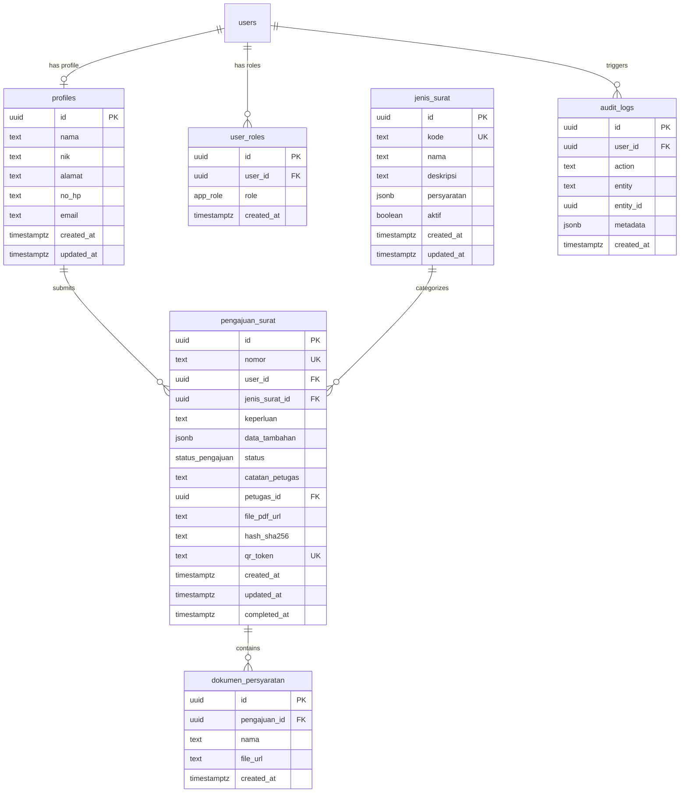

# SIPELAK — Sistem Informasi Pelayanan Administrasi Kecamatan Digital

SIPELAK adalah portal pelayanan publik mandiri yang dikembangkan untuk memodernisasi administrasi di tingkat kecamatan. Platform ini memungkinkan warga mengajukan berbagai jenis surat keterangan secara online, memantau status verifikasi secara real-time, dan mengunduh berkas surat resmi yang dilengkapi dengan QR Code dan **Tanda Tangan Digital (Digital Signature)** berbasis integritas hash kriptografi.

---

## 🛠️ Tech Stack & Arsitektur

SIPELAK dibangun menggunakan kombinasi teknologi modern untuk menjamin performa cepat, keamanan data, dan kemudahan pengembangan:

| Lapisan (Layer) | Teknologi | Keterangan |
| :--- | :--- | :--- |
| **Frontend Framework** | React 19 & TanStack Start | Framework modern dengan server-side rendering (SSR) rendering opsional dan API routing terpadu. |
| **Routing** | TanStack Router | File-based routing yang aman secara tipe (*type-safe*). |
| **State & Data Fetching**| TanStack React Query | Manajemen cache data server di sisi client secara asinkron. |
| **Styling & UI** | TailwindCSS v4 & Shadcn UI | Kerangka CSS performa tinggi dengan komponen UI Radix. |
| **Database & Backend** | Supabase (PostgreSQL) | Layanan backend terkelola (Database, Auth, Storage). |
| **ORM** | Prisma ORM | Digunakan untuk skema database (`schema.prisma`) & seeding awal. |

---

## 🔑 Hak Akses & Peran Pengguna (User Roles)

Sistem ini mendukung multi-role dengan hak akses yang terisolasi melalui **Row Level Security (RLS)** di database Supabase:

1. **Warga**:
   - Mendaftar secara mandiri melalui form registrasi.
   - Mengajukan permohonan surat keterangan baru.
   - Mengunggah berkas persyaratan (KTP, KK, Surat Pengantar RT/RW, dll.).
   - Memantau status pengajuan sendiri dan mengunduh surat yang telah disetujui.
2. **Petugas (Staff)**:
   - Memproses antrian pengajuan warga (mengubah status ke *diproses*, *disetujui*, *ditolak*, atau *selesai*).
   - Menambahkan catatan penolakan jika berkas kurang lengkap.
   - Melihat dan memeriksa berkas persyaratan warga.
3. **Administrator (Admin)**:
   - Memiliki semua kemampuan Petugas.
   - Menambahkan, memperbarui, dan menghapus akun **Petugas**.
   - Membuat, menonaktifkan, atau menghapus **Jenis Layanan Surat**.
   - Memantau aktivitas sistem melalui **Audit Logs**.

---

## 💾 Desain Database & Skema Supabase

Skema relasional didefinisikan di PostgreSQL dan terbagi dalam 6 tabel utama:



### PL/pgSQL Functions & Triggers Database

1. **`set_updated_at()`**:
   - Fungsi untuk memperbarui kolom `updated_at` otomatis sebelum proses `UPDATE` pada tabel `profiles`, `jenis_surat`, dan `pengajuan_surat`.
2. **`handle_new_user()`**:
   - Dipicu (`AFTER INSERT ON auth.users`) untuk otomatis membuat entri di tabel `public.profiles` dan memberikan role default `'warga'` di tabel `public.user_roles` setiap kali ada pendaftaran akun baru.
3. **`has_role(_user_id, _role)`**:
   - Fungsi penentu otorisasi RLS untuk memeriksa apakah user tertentu memiliki peran tertentu (`warga`, `petugas`, atau `admin`).

---

## 📂 Fitur Utama & Dokumentasi Fungsi

Berikut penjelasan lengkap fungsi, komponen, dan query database yang digunakan di setiap fitur sistem SIPELAK.

### 1. Autentikasi & Registrasi (`/auth`)
*   **File Rute**: [auth.tsx](file:///home/dimasarjuna/Documents/admin-stream/src/routes/auth.tsx)
*   **Fungsi Utama**:
    *   `loginSchema` & `registerSchema` (`zod`): Memvalidasi input form masuk dan daftar (misalnya format email, NIK harus 16 digit, kata sandi minimal 6 karakter).
    *   `supabase.auth.signInWithPassword(...)`: Digunakan dalam form masuk untuk melakukan proses otentikasi menggunakan alamat email dan kata sandi.
    *   `supabase.auth.signUp(...)`: Digunakan dalam pendaftaran warga baru dengan opsi metadata seperti nama, NIK, alamat, dan nomor telepon. Metadata ini akan ditangkap oleh trigger database `handle_new_user()` untuk menginisialisasi profil warga.
    *   `useAuth()` (`src/hooks/useAuth.tsx`): Hook kustom untuk melacak status pengguna aktif, sesi token, dan peran (*roles*) saat ini.

---

### 2. Dashboard Multi-Role (`/dashboard`)
*   **File Rute**: [dashboard.tsx](file:///home/dimasarjuna/Documents/admin-stream/src/routes/_authenticated/dashboard.tsx)
*   **Fungsi Utama**:
    *   `useAuth()`: Mengambil peran pengguna untuk menentukan dashboard yang akan dimuat (Warga, Petugas, atau Admin).
    *   **Dashboard Warga**:
        *   `supabase.from("pengajuan_surat").select(...)`: Mengambil seluruh daftar pengajuan milik warga yang aktif.
        *   `reduce` array: Menghitung total pengajuan berdasarkan status (*menunggu_verifikasi*, *selesai*, *ditolak*).
    *   **Dashboard Petugas**:
        *   `supabase.from("pengajuan_surat").select(...)`: Mengambil semua pengajuan masuk untuk antrian verifikasi.
        *   Filter Bulan & Grafik (`recharts`): Memetakan tren pengajuan surat masuk selama 6 bulan terakhir ke dalam diagram batang `<BarChart>`.
    *   **Dashboard Admin**:
        *   `Promise.all([...])`: Menjalankan beberapa query Supabase sekaligus untuk memuat statistik global:
            *   Jumlah user aktif (dari `profiles`).
            *   Jumlah jenis surat aktif (dari `jenis_surat`).
            *   Total pengajuan surat di sistem.
            *   6 baris audit terakhir dari tabel `audit_logs`.
        *   `<PieChart>` (`recharts`): Menampilkan distribusi jenis surat yang paling banyak diajukan.

---

### 3. Pengajuan Surat Mandiri (`/pengajuan/baru`)
*   **File Rute**: [baru.tsx](file:///home/dimasarjuna/Documents/admin-stream/src/routes/_authenticated/pengajuan/baru.tsx)
*   **Fungsi Utama**:
    *   `supabase.from("jenis_surat").select("*").eq("aktif", true)`: Mengambil daftar layanan surat yang aktif untuk ditampilkan sebagai pilihan kartu.
    *   `generateNomor(kode)` (`src/lib/sipelak.ts`): Menghasilkan nomor registrasi surat unik dengan format `[KODE_SURAT]/[TAHUN_BULAN]/[ANGKA_RANDOM]` (contoh: `SKD/202606/7483`).
    *   `generateToken()` (`src/lib/sipelak.ts`): Menghasilkan token acak 32 karakter hex menggunakan `crypto.getRandomValues` untuk token verifikasi publik/QR Code.
    *   `supabase.storage.from("dokumen").upload(path, file)`: Mengunggah berkas persyaratan pemohon ke bucket penyimpanan Supabase. File diletakkan di bawah subfolder `[userId]/[pengajuanId]/[nama_persyaratan].[ekstensi]` untuk isolasi keamanan.
    *   `supabase.from("pengajuan_surat").insert(...)`: Membuat baris pengajuan surat baru.
    *   `supabase.from("dokumen_persyaratan").insert(...)`: Memasukkan daftar berkas yang diunggah beserta URL publik penyimpanannya ke database.
    *   `supabase.from("audit_logs").insert(...)`: Mencatat tindakan pembuatan pengajuan oleh warga sebagai riwayat log audit.

---

### 4. Detail Pengajuan & Panel Kendali (`/pengajuan/$id`)
*   **File Rute**: [$id.tsx](file:///home/dimasarjuna/Documents/admin-stream/src/routes/_authenticated/pengajuan/$id.tsx)
*   **Fungsi Utama**:
    *   `supabase.from("pengajuan_surat").select(...).eq("id", id).single()`: Membaca detail pengajuan surat berdasarkan parameter ID rute.
    *   `supabase.from("dokumen_persyaratan").select("*").eq("pengajuan_id", id)`: Memuat daftar dokumen persyaratan yang telah diunggah pemohon.
    *   `updateStatus(status, catatan_petugas)`: Dipanggil oleh petugas/admin untuk mengubah status pengajuan berkas:
        *   Jika status diubah menjadi **`selesai`** (surat diterbitkan), sistem akan mencatat waktu `completed_at` dan menghitung **Digital Signature Hash** melalui fungsi `sha256()`.
    *   `sha256(text)` (`src/lib/sipelak.ts`): Mengenkripsi string gabungan data surat (`nomor|kode|user_id|created_at`) menggunakan algoritma enkripsi SHA-256 bawaan peramban (`crypto.subtle.digest`) untuk memastikan keaslian berkas fisik dan mencegah manipulasi dokumen di kemudian hari.
    *   `supabase.from("audit_logs").insert(...)`: Mencatat log audit peninjauan atau perubahan status pengajuan oleh petugas.
    *   `window.print()`: Digunakan untuk mencetak surat secara langsung melalui printer atau menyimpannya sebagai file PDF.

---

### 5. Verifikasi Keaslian Dokumen Publik (`/verifikasi`)
*   **File Rute**: [verifikasi.tsx](file:///home/dimasarjuna/Documents/admin-stream/src/routes/verifikasi.tsx)
*   **Fungsi Utama**:
    *   `cek(token)`: Melakukan pencarian data pengajuan pada tabel `pengajuan_surat` berdasarkan nilai `qr_token` atau nomor surat yang dicari.
        *   Query menggunakan operator `.or("qr_token.eq.token, nomor.eq.token")` dan `.maybeSingle()`.
        *   Jika pengajuan berstatus `'selesai'`, sistem akan memuat nama pemohon dari tabel `profiles` dan memvalidasi keaslian dokumen.
        *   Jika data ditemukan namun status belum `'selesai'`, sistem memberikan peringatan bahwa surat belum resmi diterbitkan.
        *   *Fitur ini dapat diakses secara publik (tanpa login) berkat kebijakan RLS: `"Verifikasi publik via token" ON public.pengajuan_surat FOR SELECT TO anon USING (qr_token IS NOT NULL)`.*

---

### 6. Arsip Surat Terbit (`/arsip`)
*   **File Rute**: [arsip.tsx](file:///home/dimasarjuna/Documents/admin-stream/src/routes/_authenticated/arsip.tsx)
*   **Fungsi Utama**:
    *   `supabase.from("pengajuan_surat").select(...).eq("status", "selesai")`: Menarik data surat-surat yang telah selesai diproses untuk diarsipkan.
    *   `.filter(...)` array client: Menyaring hasil pencarian secara real-time berdasarkan nomor surat atau nama jenis surat yang diinput oleh pengguna di kolom pencarian.

---

### 7. Kelola Akun Petugas — Admin Panel (`/admin/users`)
*   **File Rute**: [users.tsx](file:///home/dimasarjuna/Documents/admin-stream/src/routes/_authenticated/admin/users.tsx)
*   **Fungsi Server-side (TanStack Start Server Functions)**:
    Karena modifikasi pengguna pada auth Supabase memerlukan hak akses tingkat tinggi (*service role* / admin auth), aksi ini dieksekusi di sisi server melalui berkas [users.functions.ts](file:///home/dimasarjuna/Documents/admin-stream/src/lib/users.functions.ts):
    
    1.  `listPetugas()`:
        *   Mengecek apakah user yang memanggil adalah admin (`has_role`).
        *   Mengambil daftar `user_id` yang memiliki peran `'petugas'` dari tabel `user_roles`.
        *   Menarik data profil lengkap petugas dari tabel `profiles` berdasarkan daftar ID tersebut.
    2.  `createPetugas(email, password, nama, no_hp, nik)`:
        *   Membuat kredensial login baru di Supabase Auth melalui `supabaseAdmin.auth.admin.createUser`.
        *   Menghapus peran default `'warga'` yang otomatis dibuat oleh trigger database, lalu memasukkan peran `'petugas'` ke tabel `user_roles`.
    3.  `updatePetugas(userId, email, password, nama, no_hp, nik)`:
        *   Mengubah data email, kata sandi, atau metadata petugas di auth melalui `supabaseAdmin.auth.admin.updateUserById`.
        *   Memperbarui data profil di tabel `profiles`.
    4.  `deletePetugas(userId)`:
        *   Menghapus akun petugas sepenuhnya dari sistem autentikasi dan database menggunakan `supabaseAdmin.auth.admin.deleteUser`.

---

### 8. Kelola Layanan Jenis Surat — Admin Panel (`/admin/jenis-surat`)
*   **File Rute**: [jenis-surat.tsx](file:///home/dimasarjuna/Documents/admin-stream/src/routes/_authenticated/admin/jenis-surat.tsx)
*   **Fungsi Utama**:
    *   `supabase.from("jenis_surat").insert(...)`: Menambahkan jenis surat baru beserta syarat berkas dokumen (dikonversi dari input teks baris demi baris menggunakan `.split("\n")`).
    *   `supabase.from("jenis_surat").update({ aktif: !aktif }).eq("id", id)`: Mengubah status aktif/nonaktif jenis surat. Jika nonaktif, jenis surat tidak akan muncul dalam opsi formulir pengajuan warga.
    *   `supabase.from("jenis_surat").delete().eq("id", id)`: Menghapus data jenis surat dari database.

---

### 9. Log Audit Sistem — Admin Panel (`/admin/audit`)
*   **File Rute**: [audit.tsx](file:///home/dimasarjuna/Documents/admin-stream/src/routes/_authenticated/admin/audit.tsx)
*   **Fungsi Utama**:
    *   `supabase.from("audit_logs").select("*").order("created_at", { ascending: false }).limit(200)`: Mengambil 200 riwayat aktivitas log audit terakhir yang dilakukan oleh petugas maupun warga untuk pengawasan keamanan (*security monitoring*).

---

## 🔧 File Helper & Fungsi Utilitas (`sipelak.ts`)

Seluruh fungsi utilitas global diletakkan pada berkas [sipelak.ts](file:///home/dimasarjuna/Documents/admin-stream/src/lib/sipelak.ts):

```typescript
// 1. Label Tampilan Status & Skema Warna Tailwind
export const STATUS_LABEL: Record<string, { label: string; tone: string }> = {
  menunggu_verifikasi: { label: "MENUNGGU VERIFIKASI", tone: "bg-warning/10 text-warning-foreground border-warning/20 border font-bold" },
  diproses: { label: "SEDANG DIPROSES", tone: "bg-info/10 text-info border-info/20 border font-bold" },
  disetujui: { label: "BERKAS DISETUJUI", tone: "bg-success/10 text-success border-success/20 border font-bold" },
  ditolak: { label: "PENGAJUAN DITOLAK", tone: "bg-destructive/10 text-destructive border-destructive/20 border font-bold" },
  selesai: { label: "SURAT TERBIT", tone: "bg-primary text-primary-foreground border-primary border font-bold" },
};

// 2. Format Tanggal Standar Indonesia (Lokal)
export function formatTanggal(s?: string | null) {
  if (!s) return "-";
  return new Date(s).toLocaleString("id-ID", { dateStyle: "medium", timeStyle: "short" });
}

// 3. Enkripsi Tanda Tangan Digital SHA-256
export async function sha256(text: string): Promise<string> {
  const buf = new TextEncoder().encode(text);
  const hash = await crypto.subtle.digest("SHA-256", buf);
  return Array.from(new Uint8Array(hash)).map((b) => b.toString(16).padStart(2, "0")).join("");
}

// 4. Generator Nomor Registrasi Surat Keterangan
export function generateNomor(kode: string) {
  const now = new Date();
  const ym = `${now.getFullYear()}${String(now.getMonth() + 1).padStart(2, "0")}`;
  const rand = Math.floor(Math.random() * 9000 + 1000);
  return `${kode}/${ym}/${rand}`;
}

// 5. Generator Token Unik QR Code Verifikasi
export function generateToken() {
  const arr = new Uint8Array(16);
  crypto.getRandomValues(arr);
  return Array.from(arr).map((b) => b.toString(16).padStart(2, "0")).join("");
}
```

---

## 🔒 Kebijakan Penyimpanan Berkas (Supabase Storage)

Berkas persyaratan disimpan secara terisolasi pada bucket `'dokumen'` dengan kebijakan keamanan sebagai berikut:
1.  **Insert**: Hanya user terautentikasi (`authenticated`) yang bisa mengunggah berkas, dan nama folder terluar wajib sama dengan ID user mereka (`auth.uid()`).
2.  **Select**: Warga hanya dapat melihat/mengunduh file di dalam folder ID mereka sendiri. Sedangkan **Petugas** dan **Admin** diberikan akses penuh untuk membaca seluruh dokumen demi kebutuhan verifikasi berkas pengajuan.
3.  **Delete**: Warga hanya dapat menghapus berkas yang berada di dalam folder ID mereka sendiri.
